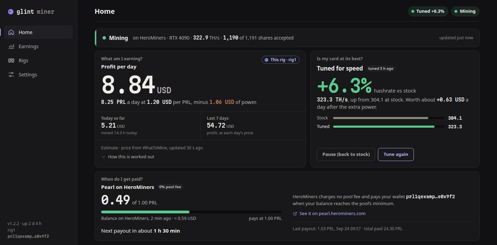
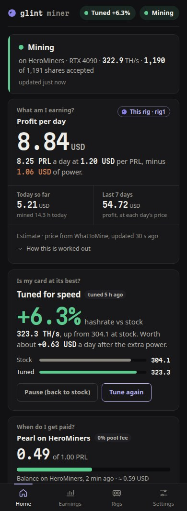
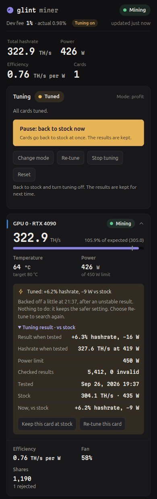

<div align="center">

# GlintMiner

### 大约一分钟，让你的 NVIDIA 显卡开始挖 Pearl。

**选择收款方式，粘贴地址，开始赚钱。**


### [⬇ 下载 GlintMiner 1.2.8](../../releases/latest)
Windows · Linux · HiveOS · 免费使用，开发者抽水 1%

[English](README.md) · [Русский](README.ru.md) · **简体中文**



</div>

---

GlintMiner 是一款在 NVIDIA 显卡上挖 **Pearl (PRL)** 的矿工软件。它的目标是让每一瓦电挖出尽可能多的 Pearl，同时也是上手最简单的矿工软件：不用改配置文件，不用写 bat 脚本，也不用学命令行。它会问你想用什么方式收款、收益发到哪里，然后实时显示你的显卡实际能赚多少钱。

**1.2.8 新功能：** **RTX 50 显卡挖得更快**：每张显卡在启动时试用各种挖矿方式，并保留最快的一种 · **RTX 20 系列和 CMP 40HX** 可以挖矿 · **在面板上更新**，校验签名，出问题自动回退 · 大型矿机调校时不再长时间高温运行，并可设置整台矿机的功耗预算 · “比较模式” · 在屏蔽 DNS 的网络上通过安全 DNS 正常工作 · 驱动停止响应的显卡会被暂停，而不是让整个程序反复重启 · **推荐码**：不多花一分钱支持推荐你的人，或者自己成为推荐人。[全部更新内容](CHANGELOG.md)

## 为什么选择 GlintMiner

| RTX 4090，出厂频率 | **GlintMiner** | 最接近的竞品 |
|---|:-:|:-:|
| 算力 @ 435 W | **304 TH/s** | 302 TH/s |
| 算力 @ 300 W | **258 TH/s** | 235 TH/s |
| 能效 @ 300 W | **每瓦 0.86 TH/s** | 0.78 |
| 全部费用（PRL 结算） | **1%**（HeroMiners 矿池费 0%） | 1–3%（软件 0%，矿池 1–3%） |
| 上手方式 | **粘贴钱包地址** | 修改 .bat 文件 |

<sub>测试于 2026 年 9 月：单张 RTX 4090，两款软件在同一张卡、同一天测试。“最接近的竞品”指我们测试过的其他 Pearl 挖矿软件中最快的一款；它不收软件抽水，但只能在自家矿池挖矿，而该矿池收费。实际结果因显卡、驱动和设置而异。</sub>

**用户矿机实测。** 六张 RTX 3090 加一张 RTX 4070 Ti，运行 HiveOS，三款挖矿软件使用完全相同的超频设置：

| 6× RTX 3090 + RTX 4070 Ti | **GlintMiner** | 其他挖矿软件 A | 其他挖矿软件 B |
|---|:-:|:-:|:-:|
| 算力 | **930 TH/s** | 913 TH/s | 900 TH/s |
| 功耗 | **1,536 W** | 1,629 W | 1,629 W |
| 每瓦算力（TH/s） | **0.61** | 0.56 | 0.55 |
| 单张 RTX 4070 Ti | **152 TH/s**（180 W） | 147 TH/s | 147 TH/s |

<sub>用户本人在 HiveOS 中的读数，2026 年 9 月，经其同意公开：每款软件在同一台矿机上、使用相同的频率和功耗上限运行。读数为某一时刻的数值；实际结果因显卡、驱动和设置而异。</sub>

**开启自动调校（可选）。** 让 GlintMiner 为你的显卡找到最佳稳定设置：

| RTX 4090 | 算力 | 功耗 | 每瓦 TH/s |
|---|:-:|:-:|:-:|
| 出厂 | 310 TH/s | 443 W | 0.70 |
| **自动调校：算力最高** | **332 TH/s**（+7%） | 430 W | 0.77 |
| **自动调校：更省电** | 310 TH/s | **338 W**（−24%） | **0.92** |

<sub>GlintMiner 在 Kryptex 实际挖矿，2026 年 9 月，单张 RTX 4090。每颗芯片都略有不同，你的显卡结果也会不同。</sub>

**各显卡出厂算力（1.2.8）。** 不调校，每张显卡使用其默认功耗上限：

| 显卡 | 算力 | 功耗上限 | 每瓦 TH/s |
|---|:-:|:-:|:-:|
| RTX 5090 | 423–426 TH/s | 600 W | 0.71 |
| RTX 5080 | 223 TH/s | 360 W | 0.62 |
| RTX 5070 | 129 TH/s | 250 W | 0.52 |
| RTX 5060 | 77 TH/s | 145 W | 0.53 |
| RTX 4090 | 315 TH/s | 450 W | 0.70 |
| RTX 4070 | 118 TH/s | 200 W | 0.59 |
| RTX 4060 Ti | 89 TH/s | 160 W | 0.56 |
| RTX 3070 | 81 TH/s | 220 W | 0.37 |
| RTX 3060 | 48 TH/s | 170 W | 0.28 |
| RTX 2070 SUPER | 63 TH/s | 215 W | 0.29 |

<sub>租用的显卡，使用各自的默认功耗上限，每个份额都经矿池验证。功耗上限为 575 W 的 RTX 5090 约为 395 TH/s。算力因显卡和散热不同会有几个百分点的差异。</sub>

- **每瓦挖得更多。** 满功耗时全速运行；为了温度、噪音或电费限制显卡功耗时，也能保留更多算力。
- **PRL 结算总费用仅 1%。** 我们抽水 1%，HeroMiners 不收矿池费。抽水过程全程可见。
- **想要什么币就付什么币。** 可以把 Pearl 直接挖到你自己的钱包，也可以通过 Kryptex 收 Bitcoin/USDT/USDC，或通过 unMineable 收 Bitcoin、Litecoin、Dogecoin、Solana 以及另外约 25 种币。
- **收益一目了然。** 以你的货币显示每日收益；填入电价后还能显示扣除电费后的利润。
- **保护你的硬件。** 每张显卡的温度都对照它自己的安全上限进行监控，上限直接从显卡读取。温度偏高的显卡会自动降低功耗，接近上限的显卡会暂停，冷却后再继续。
- **想从显卡榨出更多，也可以。** 可选的[自动调校](docs/auto-tune.zh-CN.md)会在挖矿时为你的显卡找到最佳稳定设置：通常高 4–9% 的算力、以更低的功耗保持同样算力（视显卡而定，最多低近一半），或以出厂速度的 70–90% 换来功耗低四分之一到一半以上、明显更凉更安静的显卡，并以瓦数显示每个程度在你的显卡上的目标；面板上的“比较模式”会把所有模式并排列出，显示你的显卡的 TH/s、瓦数和按你的电价计算的每天利润。多卡矿机逐张调校，排队等待的显卡保持你的超频或以较低功耗运行（还可以为整台矿机设置功耗预算）。
- **游戏优先。** 在 Windows 上，你玩游戏时挖矿会自动暂停，游戏结束一分钟后继续；游戏期间显卡处于出厂设置。[计划](docs/auto-tune.zh-CN.md#计划)可以在夜里换用更安静的模式，或在电价高峰时段暂停挖矿。
- **开了就不用管。** 看门狗、自动切换备用矿池、加密的矿池连接，需要你处理时给出通俗易懂的提示。随时随地都能用[手机](docs/phone-access.zh-CN.md)查看。

<p align="center">
  
  &nbsp;&nbsp;
  
</p>
<p align="center"><sub>手机上的面板：收益一目了然，以及自动调校后的显卡。</sub></p>

---

## 三步开始挖矿

你需要一张 **NVIDIA RTX 20、30、40 或 50 系列显卡**（并安装较新的驱动），以及**一个收款的地方**：

| 你有 | 收到的币 | 在 1% 开发者抽水之外的费用 |
|---|---|---|
| **Pearl 地址**（`prl1…`，在 Pearl 钱包 App 中免费获取） | PRL，通过 HeroMiners | **无**（最划算） |
| 同一个 Pearl 地址，改用 Kryptex | PRL，每个份额都付费，满 1 PRL 起付 | 2% |
| **Kryptex 账户**（`krx…`，在 pool.kryptex.com 免费注册） | BTC，可提现为 BTC、USDT 或 USDC | 2% |
| **其他币**的地址（BTC、LTC、DOGE、SOL 等） | 该币种，通过 unMineable | 1% |

**1. 下载**：从[最新版本](../../releases/latest)页面下载适合你电脑的文件：`…-windows.zip`、`…-linux.tar.gz`，HiveOS 矿机则下载 `glint-….tar.gz`。

**2. 解压并运行** `glint.exe`（Linux：`./glint`）。如果 Windows 提示 *“Windows 已保护你的电脑”*，点击 **更多信息 → 仍要运行**；对于下载量还不多的新程序，Windows 都会这样提示。

**3. 回答几个问题。** 每个问题都用数字回答：输入数字并按 Enter。如果你已经复制了地址，GlintMiner 会在剪贴板里找到它。之后它就开始挖矿，并记住你的回答，下次直接使用。

你的面板地址是 **http://127.0.0.1:4078**：运行是否正常、赚了多少、显卡调优情况以及什么时候到账。完整的操作说明，包括每个设置问题和支付方式的介绍，请看 **[入门指南](docs/getting-started.zh-CN.md)**。

> **提示：** 让它一直运行。矿池按稳定的工作量付费，全天候运行的显卡比每晚开开关关的显卡赚得多得多。

## 文档

| 指南 | 内容 |
|---|---|
| **[入门指南](docs/getting-started.zh-CN.md)** | 选择收款方式、逐步设置、什么时候到账、更新与卸载 |
| **[面板](docs/dashboard.zh-CN.md)** | 逐一介绍每个页面：首页、收益、矿机和设置 |
| **[自动调校](docs/auto-tune.zh-CN.md)** | 五个选项、如何调出最佳结果、调校期间会发生什么、如何保护你的显卡 |
| **[手机查看](docs/phone-access.zh-CN.md)** | 用手机查看矿机，在家或通过 Tailscale 随时随地 |
| **[矿机用户与进阶用户](docs/advanced.zh-CN.md)** | 全部命令行参数、多显卡与多台矿机、矿池、HiveOS、MMPOS、Docker、systemd、统计 API |
| **[常见问题与故障排除](docs/faq.zh-CN.md)** | 常见问题、常见故障的解决方法、校验下载文件、获取帮助 |
| **平台常见问题：** [Windows](docs/faq-windows.zh-CN.md) · [Linux](docs/faq-linux.zh-CN.md) · [HiveOS](docs/faq-hiveos.zh-CN.md) · [MMPOS](docs/faq-mmpos.zh-CN.md) · [Docker](docs/faq-docker.zh-CN.md) | 各平台的解答：开机启动或作为服务运行、所需的权限、在该平台上使用自动调校、日志、更新与移除 |
| **[HiveOS](hiveos/README.md)** · **[MMPOS](mmpos/README.md)** · **[Docker](docker/README.md)** | 在各平台上设置 GlintMiner |
| **[更新日志](CHANGELOG.md)** | 每个版本的变化 |

## 1% 开发者抽水，公开透明

- 每张显卡大约每一百秒中有一秒为开发者挖矿。矿池看到的算力是平稳的，不会像某些矿工软件那样出现长达一分钟的空档。
- 控制台和面板会显示抽水比例和目前为止实际抽取的数量。除此之外，绝不收取任何费用。
- 如果抽水服务器无法连接，抽水会改走你自己矿池的服务器。如果仍然不行，你照常挖矿，改为让 1% 的时间空闲。如果抽水连续 24 小时完全无法连接，而你自己的矿池正常，挖矿会暂停，直到抽水能够连接（需要放行什么、如何使用安全 DNS，见[常见问题](docs/faq.zh-CN.md)）。短暂中断错过的部分之后会慢慢补上，最多约一小时的量：总计绝不超过 1%。
- 抽水份额带有一个匿名标签：显卡型号与数量、结算方式、GlintMiner 版本以及显卡是否已调校（例如 `g4687ad-hmv125s-4090x1`），让开发者了解 GlintMiner 的使用情况。绝不包含你的钱包、矿机名、IP 地址或位置。

**推荐码。**如果有人向你推荐了 GlintMiner，可以在首次设置时、在“设置 → 推荐码”中、用 `--affiliate 推荐码`（HiveOS 和 mmpOS：加到额外参数里；`--affiliate off` 可删除）或在 `glint.json` 中用 `"affiliate"` 填写他的推荐码。你仍然只付 1%：其中四分之一（0.25% 的时间）改为挖到推荐人的 PRL 钱包，而不是开发者的。你绝不会多付，抽水的其他规则与上面完全相同。推荐码来自一个单独的公开仓库 [GlintMiner-affiliates](https://github.com/MaccaDaStaka/GlintMiner-affiliates) 中的列表，用一把只用于推荐码列表的密钥签名（绝不用于更新，发布版密钥也绝不会被当作推荐码列表的密钥）；GlintMiner 会自行校验签名，并且只有在你填写了推荐码时才会查找更新的列表（启动时和每天一次）。列表整份下载，在你的矿机上查找：不会为此发送任何关于你的信息。不在列表中的推荐码显示为“无法识别”，1% 全部归开发者。推荐人的那部分在开发者抽水自己的服务器上挖，用推荐人的钱包和矿工名 `glint` 登录（他的矿池页面上看不到你矿机的任何信息）；如果无法连接，或矿池拒绝推荐人的钱包，这部分改归开发者。

**成为推荐人。**把其他矿工带来，每台使用你推荐码的矿机，其抽水的四分之一归你，由矿池支付到你的 PRL 钱包。在“设置 → 成为推荐人”中申请，没有屏幕的矿机可以用 `glint --become-affiliate`。发送之前你会看到将发送的全部内容：你填写的 PRL 收款钱包（可以与挖矿使用的钱包不同）、你填写的 Discord 用户名（如有）、此安装的匿名 id 和 GlintMiner 版本；只有在你勾选确认（或输入 `yes`）后才会发送。Discord 用户名是可选的，但要在 [Discord](https://discord.gg/dXBTwVzJNy) 上获得推荐人身份组和频道就需要它：开发者逐一人工审核，通过后 Discord 机器人会自动给你身份组，你也会拿到自己的推荐码；申请通过后，推荐码列表会在几分钟内自动签名并发布；正在运行的矿工会在启动时或一天之内获取它。面板（或再次运行 `--become-affiliate`）会显示申请是等待中、已通过还是未通过。

## 匿名签到

从 1.2.8 起，GlintMiner 在启动约 2 分钟后发送一次、之后每 15 分钟通过 HTTPS 向开发者发送一条简短的匿名签到：

- **发送的内容：**安装的匿名 id（与抽水标签中的 `g4687ad` 相同：是你收款地址的哈希，而不是地址本身）、本次运行的随机 id（每次启动都会更换）、GlintMiner 版本、操作系统和平台（Windows、Linux、HiveOS、mmpOS、Docker）、显卡型号与数量（`4090 ×1`）、总算力和显卡总功耗（以及每瓦 TH/s）、结算方式（HeroMiners、Kryptex、unMineable、其他矿池）、运行时长，以及：
  - **每张显卡：**简短型号（`4090`）、算力、功耗、温度、风扇转速、等待 CPU 的时间占比，以及调校状态（已调校、调校中、排队等待或默认设置）和所用模式；
  - **每张显卡调校期间：**所处阶段的通俗说法（测量默认设置、寻找能效点、测试设置、确认设置、测量结果、排队等待、已回退、暂停、已调校、关闭）、完成比例、剩余与已用时间、清凉模式强度对应的目标瓦数，以及回退的步数（只有数量）；整台矿机则发送最长剩余时间和完成比例；
  - **运行状况：**启动以来被接受、被拒绝、过期和无效的份额数，GPU 错误次数及其中 GlintMiner 自行恢复的次数，上次运行如何结束（正常、崩溃、因 GPU 故障自行重启、出错停止或被外部停止）及一个词的原因（调校时或其他时候 GPU 停止响应、GPU 错误、更新、回退、新设置、由你或系统停止、崩溃或未知；原因在 GPU 时附上 GPU 编号），过去 24 小时内 GlintMiner 自行重启的次数，矿池发来新任务后显卡仍在挖旧任务的最长时间（处理器太忙，无法及时准备新工作），崩溃时只发送 GlintMiner 代码中的位置（文件名和行号，如 `tune.rs:812`），绝不发送错误文字；
  - **自动调校的结果：**关闭、调校中、已调校或部分调校，模式（算力最高、更省电、收益最高、凉爽安静及其强度），以及已调校、调校中、等待和默认设置的显卡数量；
  - **抽水状态：**通过自己的矿池支付、通过你的矿池支付（其自己的服务器无法连接）、因无法连接任何抽水服务器而空闲、重连中；被接受的抽水份额和所占工作比例；
  - **更新：**你的更新设置（询问、自动、关闭）以及是否发生过更新回退；
  - NVIDIA 驱动版本及其支持的 CUDA 版本；
  - 你的矿机为其挖取抽水份额的推荐码（仅当你填写了可识别的推荐码；只发送推荐码，绝不发送推荐人的钱包）。
- **绝不发送的内容：**你的钱包、矿工名或矿机名、矿池地址或登录名、Telegram 信息、主机名、文件夹名、位置，以及任何调校细节（频率、偏移、功耗上限、电压、调校步骤）。不会保存你的 IP 地址；服务器只在内存中用它来防止滥用。GlintMiner 启动时会在日志中写出同样的清单。GlintMiner 唯一会发送钱包的情况是上面的推荐人申请：你在那里填写的收款钱包，而且只在你确认之后。
- **为什么：**抽水份额很少（每台矿机每 10 到 60 分钟一个），无法据此了解有多少矿机在运行哪些版本和显卡，以及抽水是否到账。一台有签到却没有抽水份额的矿机，说明抽水出了需要排查的问题。
- **如何关闭：**用 `--no-telemetry` 启动 GlintMiner（HiveOS：加到飞行表的额外配置参数里；mmpOS：加到 START 行），或在 `glint.json` 中设置 `"telemetry": false`。挖矿完全不受影响。签到失败不会显示，也不会拖慢挖矿。

## 值得信赖

- **每个份额在提交前都会在你的电脑上**用 Pearl 官方校验器验证。如果 Pearl 网络规则变更，GlintMiner 会停下来提示你更新，而不是继续提交会被拒绝的份额。
- **默认使用出厂设置，除非你另行选择。** 默认情况下 GlintMiner 从不改动频率、电压或风扇，只会在显卡过热时调低功耗上限。只有你开启自动调校后，它才会调整频率；GlintMiner 所做的一切更改都会在关闭时恢复，或在崩溃后的下一次启动时恢复。
- **没有意外。** 只有在你同意（或开启自动更新）时才会安装更新，且只安装用 GlintMiner 发布密钥签名的版本；运行不正常的版本会被回退。见[更新](#更新)。
- **设置掌握在你手中，** 都保存在程序旁边的 `glint.json` 中。不会在其他地方安装任何东西。
- **每个文件都有校验值。** 对照 `SHA256SUMS.txt` [校验下载文件](docs/faq.zh-CN.md#校验下载文件)。

## 更新

GlintMiner 每天在 GitHub 上检查一次是否有新版本。之后怎么做由你决定（设置 → 更新，或 `--auto-update ask|auto|off`）：

- **询问我**（默认）：面板和控制台会显示 *GlintMiner X is available* 以及发布说明中的几行要点，由你选择**立即更新**、**稍后**（大约一天后再提醒）或**跳过此版本**。
- **自动安装**：在没有显卡处于调优过程中时安装新版本，然后重启（约一分钟不挖矿）。如果调优让某张显卡忙了一整天，它会改为询问你。
- **不检查**：不自动检查。**立即检查更新**（设置 → 更新）和 `glint --update` 仍然可用。

每个更新在做任何更改之前都会被校验。`SHA256SUMS.txt` 必须带有 GlintMiner 发布密钥的有效签名，该密钥内置在程序中（绝不信任随下载一起提供的密钥）；安装包及其中的程序必须与该文件中对应的行一致；版本必须比你当前的新；新程序会先启动一次，确认它能运行且确实是该版本。任何一项校验失败，都不会做任何更改，GlintMiner 会告诉你。你的设置、钱包、已保存的调优和历史记录都会保留，更新也绝不会改变开发者抽水。

旧程序会保留在新程序旁边（`glint.prev.exe`，Linux 上为 `glint.prev`）。如果新版本启动失败，或在最初 15 分钟内反复停止，GlintMiner 会恢复旧版本、启动它并告诉你：*Update to X didn't run properly on this rig, so GlintMiner went back to Y.* 该版本不会再被提示。

在 **HiveOS** 和 **mmpOS** 上由系统自己的软件包管理器安装 GlintMiner，所以它不会在那里替换自己：它会显示要填入飞行表（或自定义矿工）的确切安装包链接。在 **Docker** 中，它会告诉你用哪个版本重新构建镜像。

命令行：`glint --update` 检查、校验、安装并启动新版本（如果这台电脑上已经在运行 GlintMiner，则由那个正在运行的程序自行更新）；`glint --update 1.2.9` 安装指定版本，也可以是更旧的版本（1.2.8 或之后的版本：从 1.2.8 起发布版本才带签名）；加上 `--no-start` 则只安装。

## 校验下载文件

从 1.2.8 起，每个版本的 `SHA256SUMS.txt` 都附带 `SHA256SUMS.txt.sig`，即用 GlintMiner 发布密钥做的签名。公钥在本仓库的 [glint-release.allowed_signers](glint-release.allowed_signers) 中：

```
glintminer namespaces="glintminer-release" ssh-ed25519 AAAAC3NzaC1lZDI1NTE5AAAAIKatI61DofSq+DBJwEBpSf+j8vHqs33B4rCFOXYfOrBv
```

（密钥指纹 `SHA256:LyJl6LdjKgkaI9MkBbkTsN0HHu6m12bRPrbpBWWqaPI`）。把这两个文件和密钥文件下载到同一个文件夹，然后用 OpenSSH 8.1 或更新版本运行（Linux、macOS 和 Windows 10/11 自带；在 Windows 上请用命令提示符 cmd，不要用 PowerShell）：

```
ssh-keygen -Y verify -f glint-release.allowed_signers -I glintminer -n glintminer-release -s SHA256SUMS.txt.sig < SHA256SUMS.txt
```

必须显示 `Good "glintminer-release" signature for glintminer`。然后对照 `SHA256SUMS.txt` 中该文件的那一行校验你下载的文件（[方法](docs/faq.zh-CN.md#校验下载文件)）。任何一项校验不通过，都不要运行它。

## 系统要求

- NVIDIA RTX 20 系列或更新（计算能力 7.5+，带 Tensor Core），并安装最新的 NVIDIA 驱动
- Windows 10/11 64 位，或 Linux x86-64（glibc 2.17+）；支持 HiveOS、MMPOS 和 Docker
- 每张显卡约需 1.5 GB 系统内存
- 无需安装其他任何东西：不需要 CUDA Toolkit 或运行库
- 自动调校需要管理员（Windows）或 root（Linux）权限。没有这些权限时，GlintMiner 会以出厂设置正常挖矿

## 支持

发现 bug 或有建议？请提交 [issue](../../issues)，附上显卡型号、驱动版本、`glint --self-test` 的输出以及 `glint.log` 中的相关内容。更多信息见[获取帮助](docs/faq.zh-CN.md#获取帮助)。

帮助与交流：[Discord](https://discord.gg/dXBTwVzJNy)。需要针对你自己矿机的帮助时，在 #private-help 频道点击 **Get help**，会开启一个私密话题。

## 许可

GlintMiner 可免费用于个人和商业挖矿。程序为闭源软件。详见 [LICENSE.txt](LICENSE.txt)，以及列出所用开源组件的 `THIRD_PARTY_NOTICES.txt`。
